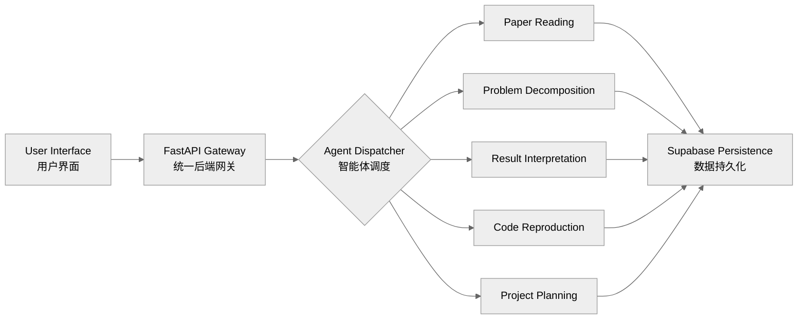
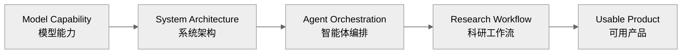

 

  

[**SciPilot**](https://github.com/telitor/SciPilot) · [**Repositories / 项目仓库**](https://github.com/telitor?tab=repositories)

---

## 01 — Profile / 个人简介

<table>
<tr>
<td width="50%" valign="top">

### English

Software Engineering student at **Dalian University of Technology**, working at the intersection of intelligent systems and software engineering.

I focus on the engineering layer between model capability and real-world use: system architecture, agent orchestration, secure data flows, persistent context, and reproducible workflows.

</td>
<td width="50%" valign="top">

### 中文

大连理工大学软件工程专业学生，关注智能系统与软件工程的交叉实践。

相比只关注模型本身，我更重视模型能力如何被组织、调度、保护与持久化，并最终形成结构清晰、能够稳定运行的完整系统。

</td>
</tr>
</table>

 

<table>
<tr>
<td width="33%" align="center" valign="top">

### AI Systems

Multi-Agent Systems  
Computer Vision  
Multimodal Intelligence

**智能系统 · 视觉 · 多模态**

</td>
<td width="33%" align="center" valign="top">

### System Engineering

Backend Architecture  
Service Boundaries  
Secure Data Flows

**后端架构 · 服务设计 · 数据安全**

</td>
<td width="33%" align="center" valign="top">

### Research Engineering

Reproducible Workflows  
Experiment Analysis  
Research Tooling

**科研工作流 · 实验分析 · 工程工具**

</td>
</tr>
</table>

---

## 02 — Featured Project / 核心项目

### [SciPilot](https://github.com/telitor/SciPilot)

> **Multi-Agent Research Engineering Platform / 多智能体科研工程平台**

<table>
<tr>
<td width="58%" valign="top">

SciPilot connects five specialized agents into one coherent research workflow, covering paper reading, problem decomposition, result interpretation, code reproduction, and project planning.

SciPilot 将五类垂直智能体接入统一系统，覆盖论文精读、问题拆解、结果分析、代码复现与项目规划，形成从用户输入到智能处理、结果展示和数据持久化的完整闭环。

**System focus / 系统重点**

- Unified FastAPI gateway / 统一后端网关
- Category-based agent routing / 基于类别的智能体调度
- Independent WebSocket runtimes / 独立 WebSocket 运行时
- Supabase Auth and RLS / 身份认证与行级权限
- Persistent conversations and messages / 会话与消息持久化

</td>
<td width="42%" valign="top">

### Agent Matrix / 智能体矩阵

`01` Paper Reading / 论文精读  
`02` Problem Decomposition / 问题拆解  
`03` Result Interpretation / 结果分析  
`04` Code Reproduction / 代码复现  
`05` Project Planning / 项目规划

### Core Stack / 核心技术

`React` · `TypeScript`  
`FastAPI` · `Pydantic`  
`Supabase` · `PostgreSQL`  
`WebSocket` · `RLS`

[**View repository → / 查看项目 →**](https://github.com/telitor/SciPilot)

</td>
</tr>
</table>

---

## 03 — Selected Work / 代表项目

<table>
<tr>
<td width="33%" valign="top">

### [Digit Recognition CNN](https://github.com/telitor/digit-recognition-cnn)

CNN-based handwritten digit recognition with model training, evaluation, and visualized inference.

基于卷积神经网络的手写数字识别项目，覆盖模型训练、性能评估与推理结果可视化。

`Python` · `PyTorch` · `OpenCV`

</td>
<td width="33%" valign="top">

### [Robot Path Planning](https://github.com/telitor/robot-path-planning)

A* path planning with map parsing, obstacle avoidance, path reconstruction, and visualization.

基于 A* 搜索的路径规划项目，实现地图解析、障碍规避、路径回溯与规划结果可视化。

`Python` · `A* Search` · `Visualization`

</td>
<td width="33%" valign="top">

### [Housing Regression](https://github.com/telitor/california-housing-regression)

Regression experiments with preprocessing, model comparison, metric evaluation, and ablation analysis.

围绕数据预处理、模型对比、评价指标与消融分析构建的机器学习回归实验。

`Python` · `scikit-learn` · `Regression`

</td>
</tr>
</table>

---

## 04 — Technical Scope / 技术能力

| Domain / 方向 | Technologies & Practices / 技术与实践 |
|---|---|
| **Agent Systems / 智能体系统** | Agent routing, independent runtime configuration, signed WebSocket communication, structured responses |
| **Backend Engineering / 后端工程** | FastAPI, Pydantic, REST APIs, authentication, service-layer design |
| **Data & Security / 数据与安全** | Supabase, PostgreSQL, Row Level Security, conversation persistence |
| **Frontend Engineering / 前端工程** | React, TypeScript, Vite, Tailwind CSS, Zustand, Axios |
| **Machine Learning / 机器学习** | PyTorch, scikit-learn, CNN, model evaluation, experiment analysis |
| **Engineering Workflow / 工程流程** | Git, GitHub, environment isolation, API documentation, reproducible setup |

 

---

## 05 — Engineering Direction / 当前方向

<table>
<tr>
<td width="50%" valign="top">

### Current Focus

- Multi-agent orchestration
- Research workflow automation
- Reliable AI application architecture
- Computer vision and multimodal systems

</td>
<td width="50%" valign="top">

### 当前关注

- 多智能体调度与协作
- 科研工作流自动化
- 可靠的 AI 应用架构
- 计算机视觉与多模态系统

</td>
</tr>
</table>

---

## 06 — Recognition / 经历

<table>
<tr>
<td width="50%" align="center">

### Dalian University of Technology

Software Engineering  
**大连理工大学 · 软件工程**

</td>
<td width="50%" align="center">

### MCM / ICM

Meritorious Winner  
**美国大学生数学建模竞赛 M 奖**

</td>
</tr>
</table>

---

### From model capability to usable systems.

**让模型能力真正进入系统，并成为可以使用的产品。**

 

[**Explore SciPilot / 查看 SciPilot**](https://github.com/telitor/SciPilot) · [**View All Repositories / 浏览全部项目**](https://github.com/telitor?tab=repositories)

 

Software Engineering · Artificial Intelligence · Research Systems

  

